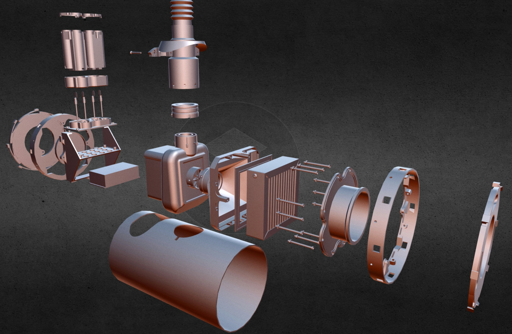

# AeraTM
AeraTM is an Open Source PAPR device (positive pressure air respirator) which is appropriate for emergency situations where properly certified commercial PAPRs are in short supply. It aims to be modular, customizable and easy-to-source, using as many off-the-shelf vitamins as possible and distributed production on 3DPrinters, Laser-Cutters, MillingMachines and so on. 

It will be provided in an Open format (the aim is a customizable OpenScad format), together with the appropriate documentation, production/installation/operation and DOFFING instructions. The documentation (please check the <a href="https://github.com/florinf-ro/AeraTM/wiki">Wiki Pages</a>) will ultimately be provided in romanian and english. Transators are always welcome to maintain other languages as well. 

AeraTM is a volunteers project started in the FaceShields discussion groups during the impressive civic mobilization of the COVID19 pandemic and spinned off as an independent initiative at the request of medical professionals in the Timisoara region of Romania.

See the exploded 3D-View of the Air Unit on SketchFab by clicking the image below:

